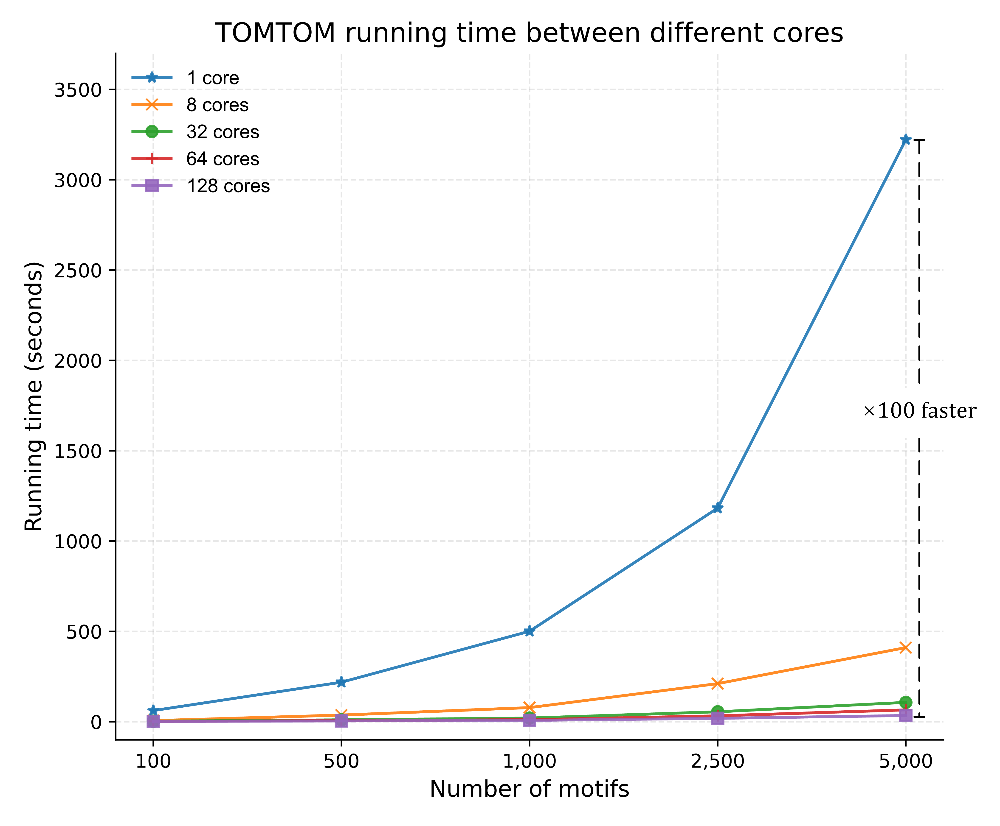

# TOMTOM Parallelization Tool
This project parallelizes the **The MEME Suite’s TOMTOM** tool using Python’s multiprocessing module to dramatically speed up bulk motif comparisons. It is designed for high-throughput automated analyses of large motif datasets.

## Features
Supports custom TOMTOM parameters to flexibly configure matching tasks.

Accepts multiple motif file formats, including `.csv`, `.txt`, and `.meme`

Compatible with DNA and RNA base characters used in the MEME Suite, enabling analysis across different sequence types. [*Standard Alphabets*](https://meme-suite.org/meme/doc/alphabets.html)

## Requirements
| environment & packages |
|:-----|
|**The MEME Suite** local version    |
|Python 3.7 or higher| 
|numpy|
|pandas|

## Usage
``python parallel_tomtom.py -TOMTOM "[tomtom command]" -motif_path [motif file path] -database_path [database file path] -save_path [save file path] -num_processes [number of processes]``
| Parameter    |   Description  |
|:----------------|-------------|
|   -TOMTOM       |`tomtom -text [options]`. Please refer to [*TOMTOM manual*](https://meme-suite.org/meme/doc/tomtom.html) for valid arguments. **Do not include input/output paths**|
|   -motif_path   |    Directory of input motif files; supports `.csv`, `.txt`, `.meme` formats    |
|  -database_path |    Path to target motif database file (e.g., JASPAR.meme file)    |
|    -save_path   |    Path to save result file, in `.csv` format only    |
| -num_processes  |    Number of parallel processes (recommended: ≤ number of CPU cores)    |

You can test the script using the following command examples (input files are located in [`./Data/`](/Data/) directory, and results will be saved in [`./Result/examples/`](/Result/examples/)):

**CSV File Input**

``python parallel_tomtom.py -TOMTOM "tomtom -text -no-ssc -oc . -verbosity 1 -min-overlap 5 -dist pearson -evalue -thresh 0.5" -motif_path ../Data/motif/Motifs.csv -database_path ../Data/db/JASPAR2022_CORE_vertebrates_non-redundant_v2.meme -save_path ../Result/examples/csv_result.csv -num_processes 2``

**TXT File Input**

``python parallel_tomtom.py -TOMTOM "tomtom -text -no-ssc -oc . -verbosity 1 -min-overlap 5 -dist pearson -evalue -thresh 0.5" -motif_path ../Data/motif/Motifs.txt -database_path ../Data/db/JASPAR2022_CORE_vertebrates_non-redundant_v2.meme -save_path ../Result/examples/txt_result.csv -num_processes 2``

**MEME File Input**

``python parallel_tomtom.py -TOMTOM "tomtom -text -no-ssc -oc . -verbosity 1 -min-overlap 5 -dist pearson -evalue -thresh 0.5" -motif_path ../Data/motif/Motifs.meme -database_path ../Data/db/JASPAR2022_CORE_vertebrates_non-redundant_v2.meme -save_path ../Result/examples/meme_result.csv -num_processes 2``

## Benchmark
We tested the script with varying numbers of CPU cores and motif(10bp) counts, and the following results were obtained:

 

Detailed runtime data is stored in the  [`./Result/benchmark/benchmark_result.csv`](/Result/benchmark/benchmark_result.csv)

## Contact
For questions or suggestions, please reach out:

[Li_jie@webmail.hzau.edu.cn](Li_jie@webmail.hzau.edu.cn)

## Reference
[1]. Gupta S, Stamatoyannopoulos JA, Bailey TL, Noble WS. Quantifying similarity between motifs. *Genome Biol*. 2007;8(2):R24.

[2]. Bailey TL, Johnson J, Grant CE, Noble WS. The MEME Suite. *Nucleic Acids Res*. 2015;43(W1):W39-W49.

